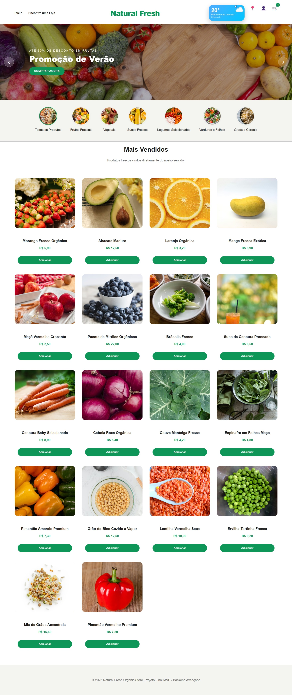
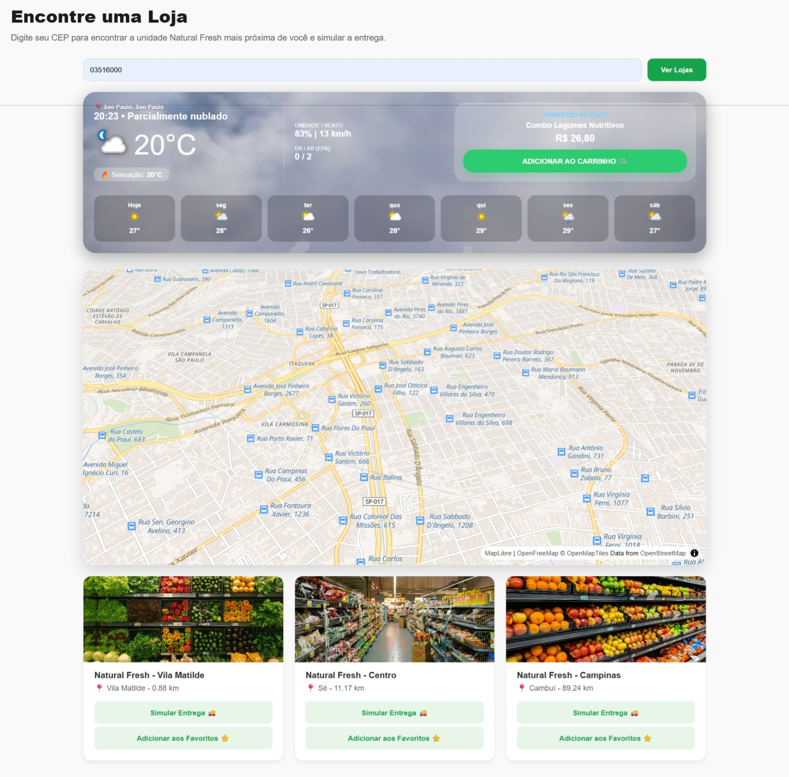
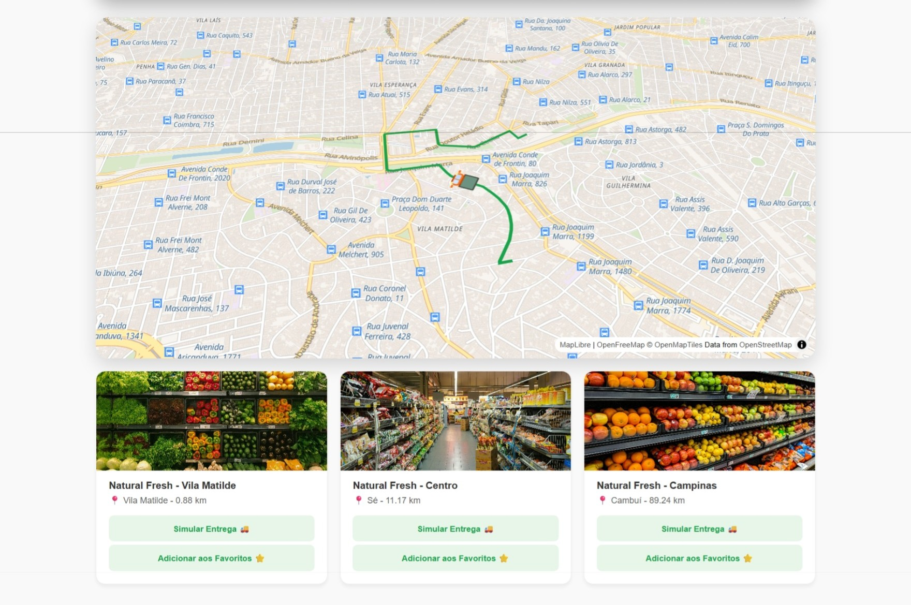
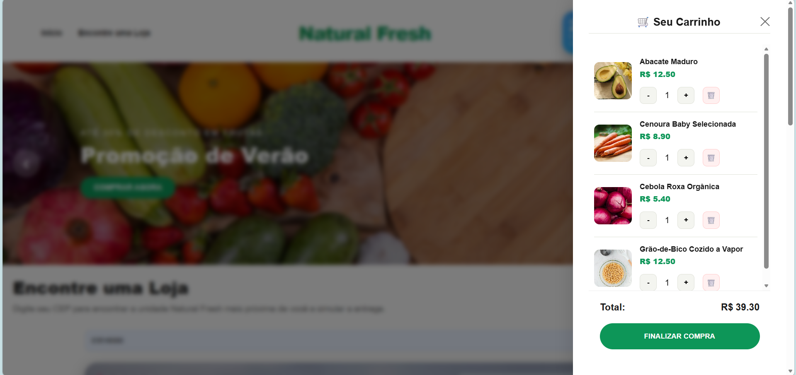

# 🛍️ Natural Organic Store - Frontend

## 📋 Sobre o Projeto

Interface web moderna para uma loja virtual de produtos orgânicos, desenvolvida como MVP do curso de Backend Avançado da PUC-Rio. O sistema integra funcionalidades de e-commerce com um dashboard climático inteligente que sugere produtos baseados na temperatura local.

### ✨ Funcionalidades Principais

- 🛒 **Carrinho de Compras**: CRUD completo com atualização em tempo real
- 📍 **Localização de Lojas**: Busca por CEP com mapa 3D interativo
- 🗺️ **Simulação de Entrega**: Animação de rota com caminhão em movimento
- 🌤️ **Dashboard de Clima**: Sugestões de produtos baseadas em temperatura
- ⭐ **Sistema de Favoritos**: Salve suas lojas preferidas
- 🖼️ **Galeria de Produtos**: Múltiplas imagens por produto

---

## 🚀 Tecnologias Utilizadas

### Frontend
- ⚛️ **React 19.2.4** - Biblioteca para interfaces
- ⚡ **Vite 8.0** - Build tool
- 🎨 **CSS Modules** - Estilização modular
- 🗺️ **MapLibre GL 5.21** - Mapas 3D interativos
- 📐 **Turf.js 7.3** - Cálculos geoespaciais
- 🧭 **React Router DOM 7.13** - Roteamento SPA

### Integrações Externas
- 🌦️ **WeatherAPI** - Dados climáticos em tempo real
- 📮 **ViaCEP** - Consulta de endereços
- 🗺️ **Geoapify** - Geolocalização e rotas

---

## 📦 Instalação e Execução

### Pré-requisitos
- Node.js 18+
- Docker (opcional)
- Backend rodando em `http://localhost:8000`

### Opção 1: Com Docker (Recomendado)

```bash
# Clone o repositório
git clone https://github.com/ledelmastro/natural-organic-frontend.git
cd natural-organic-frontend

# Edite o arquivo .env com suas chaves de API ou utilize a disponível

# Build e execute o container
docker build -t natural-organic-frontend .
docker run -p 3000:80 natural-organic-frontend

# Acesse http://localhost:3000
```

### Opção 2: Desenvolvimento Local

```bash
# Instalar dependências
npm install

# Configurar variáveis de ambiente
cp .env.example .env

# Executar em modo desenvolvimento
npm run dev

# Build para produção
npm run build
npm run preview
```

---

## 🗂️ Estrutura do Projeto
natural-organic-frontend/
├── docs/                       # Documentação e capturas de tela
│   └── screenshots/            # Ex: carrinho.png, clima-dashboard.png
├── public/                     # Ativos estáticos servidos diretamente
│   ├── Animacao-final.mp4
│   ├── Chuva.mp4
│   ├── Ensolarado.mp4
│   ├── Nublado.mp4
│   ├── Possibilidade-de-chuva.mp4
│   ├── favicon.svg
│   └── icons.svg
├── src/                        # Código-fonte da aplicação
│   ├── assets/                 # Imagens e SVGs processados pelo Vite
│   │   ├── hero.png
│   │   ├── react.svg
│   │   └── vite.svg
│   ├── components/             # Componentes reutilizáveis de UI
│   │   ├── CarrinhoLateral.jsx
│   │   ├── CategoriasMenu.jsx
│   │   ├── ClimaDashboard.jsx
│   │   ├── ClimaWidget.jsx
│   │   ├── HeroSlider.jsx
│   │   ├── ListaProdutos.jsx
│   │   ├── Localizacao.jsx
│   │   ├── ModalProduto.jsx
│   │   └── PainelUsuario.jsx
│   ├── App.jsx                 # Componente principal 
│   ├── main.jsx                # Ponto de entrada 
│   └── index.css               # Estilos globais
├── .dockerignore
├── .env                        # Variáveis de Ambiente
├── .gitignore
├── Dockerfile                  # Configuração para containerizar o frontend
├── eslint.config.js
├── index.html                  # Template HTML base
├── nginx.conf                  # Configuração para o servidor de produção
├── package.json                # Scripts e dependências (React, Vite, etc)
├── README.md
└── vite.config.js              # Configurações do compilador Vite

---

## 🌐 API Backend

Este frontend consome a API backend em:
- **Repositório**: [natural-organic-backend](https://github.com/ledelmastro/natural-organic-backend)
- **Endpoint Local**: `http://localhost:8000`
- **Documentação**: `http://localhost:8000/docs`

### Endpoints Utilizados

| Método | Rota | Descrição |
|--------|------|-----------|
| GET | `/produtos` | Lista todos os produtos |
| GET | `/carrinho` | Lista itens do carrinho |
| POST | `/carrinho` | Adiciona item ao carrinho |
| PUT | `/carrinho/{id}` | Atualiza quantidade |
| DELETE | `/carrinho/{id}` | Remove item |
| POST | `/geolocalizacao/busca` | Busca lojas por CEP |
| POST | `/geolocalizacao/rota` | Calcula rota de entrega |
| GET | `/geolocalizacao/favoritos` | Lista lojas favoritas |
| POST | `/geolocalizacao/favoritos` | Adiciona favorito |
| PUT | `/geolocalizacao/favoritos/{id}` | Edita favorito |
| DELETE | `/geolocalizacao/favoritos/{id}` | Remove favorito |

---

## 🎨 Funcionalidades Detalhadas

### 1. Dashboard de Clima Inteligente
- Busca clima por CEP usando WeatherAPI
- Background animado com vídeos (ensolarado, nublado, chuvoso)
- Sugestão de produtos baseada em temperatura:
  - **> 29°C**: Combo Tropical Verão (sucos refrescantes)
  - **< 29°C**: Combo Legumes Nutritivos
- Previsão de 7 dias
- Índice UV e qualidade do ar

### 2. Mapa 3D Interativo
- Visualização de lojas em mapa MapLibre
- Prédios 3D com inclinação de 45°
- Animação suave de rota de entrega
- Caminhão animado seguindo a rota

### 3. Sistema de Favoritos
- Salvar lojas com apelidos personalizados
- Edição de apelidos
- Remoção de favoritos
- Persistência no banco de dados

### 4. Galeria de Produtos
- Imagem principal + miniaturas
- Troca de imagem ao clicar
- Modal full-screen para detalhes

---

## 📸 Screenshots

### Página Inicial


### Dashboard de Clima


### Mapa de Lojas


### Carrinho Lateral


---

## 🛠️ Configuração de Ambiente

### Variáveis de Ambiente (.env)

```env
# API de Clima (obrigatório)
VITE_WEATHER_API_KEY=chave_weatherapi

# URL do Backend (opcional, padrão: http://localhost:8000)
VITE_API_URL=http://localhost:8000
```

### Como obter as chaves de API

1. **WeatherAPI**:
   - Cadastre-se em https://www.weatherapi.com/
   - Copie sua API Key do dashboard
   - Gratuito até 1 milhão de chamadas/mês

---

## 🏗️ Diagrama de Arquitetura

   